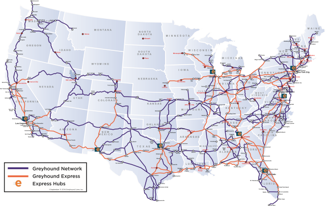

= Primera práctica
Ana María Sánchez Sánchez <UOxxxxxx@uniovi.es>
Ángel García Menéndez <UO258654@uniovi.es>
:toc: left
:toc-title: Tabla de Contenidos
:doctype: article

Memoria de la primera práctica de la asignatura Sistemas de información para la Web, realizada por **Ana María García Sánchez** (UO264030@uniovi.es) y **Ángel García Menéndez** (UO258654@uniovi.es).

== Consultas
A continuación se repasan las diferentes consutlas realizadas para cada tarea, así como los resultados obtenidos y otra información de interés.

=== greyhound:

==== Búsqueda en inglés usando Google

**Consulta literal introducida:** _Greyhound buses routes_

Resultado: 

Al introducir la consulta nos apareció un infobox con algunas rutas y sus precios, pero ningún mapa, por lo que no era lo que buscábamos. 

Al darle a _Imágenes_ nos salió https://www.google.com/search?q=Greyhound+buses+routes&rlz=1C1GCEU_esES866ES866&sxsrf=ACYBGNSNLckX1w0QsOl666eHpdrCctP9RA:1568296408261&source=lnms&tbm=isch&sa=X&ved=0ahUKEwihocSyt8vkAhVbPcAKHXNzBqAQ_AUIEigB&biw=958&bih=959#imgrc=-fxjiagniRK6QM:[el mapa que buscamos], el mapa de Estados Unidos con las rutas. Aquí adjuntamos el primer mapa de todos, que es el que satisface la consulta:
]

[#image-greyhound]
.Resultado de imagen de Greyhound buses routes 

==== Búsqueda en castellano usando Google:

**Consulta literal introducida:** _rutas buses greyhound_
                
Resultado: 

No salen infoboxes y las primeras https://www.google.com/search?safe=active&rlz=1C1GCEU_esES866ES866&biw=958&bih=959&sxsrf=ACYBGNTdhFAgl91XSNLKOMAGCF06nUnGXQ%3A1568296648665&ei=yE56Xb6jKMrWgQbzwYrQAQ&q=rutas+buses+greyhound&oq=rutas+buses+greyhound&gs_l=psy-ab.3..33i160.78364.78364..78946...0.1..0.100.100.0j1......0....2j1..gws-wiz.......0i71.-ly0_OTgIFQ&ved=0ahUKEwi-p5WluMvkAhVKa8AKHfOgAhoQ4dUDCAs&uact=5[páginas] que salen son para reservar billetes, la página de greyhound, etc.

**Consulta literal introducida:** _mapa rutas buses greyhound_

Resultado:

Si accedemos de nuevo a _Imágenes_, vuelve a salir el https://www.google.com/search?safe=active&rlz=1C1GCEU_esES866ES866&biw=958&bih=959&tbm=isch&sxsrf=ACYBGNQpg6SX9ts13XJiEtMNcfbQ3ShJsw%3A1568296766365&sa=1&ei=Pk96XcP5FcmNlwTu8q6wCQ&q=mapa+rutas+buses+greyhound&oq=mapa+rutas+buses+greyhound&gs_l=img.3...9671.10136..10371...0.0..0.119.443.4j1......0....1..gws-wiz-img.wSQ61Fuyw7o&ved=0ahUKEwjDkKXduMvkAhXJxoUKHW65C5YQ4dUDCAY&uact=5[mapa] anterior en el primer resultado.

==== Búsqueda en inglés usando DuckDuckGo

**Consulta literal introducida:** _route map GreyHound buses_
                
Resultado: 

Dentro de los enlaces que salen, se ve que el mapa está en https://www.greyhound.co.za/route-map/[uno de los primeros] (el tercer resultado sin contar anuncios) con título: Route Map | Greyhound Busses

Pero si vamos a “Imágenes” directamente, sale el mapa en el primer resultado.      
 greyhound bus USA - Route Map.. | travel | Bus map, Travel ... 

==== Búsqueda en castellano usando DuckDuckGo

**Consulta literal introducida:** _mapa rutas buses greyhound_
                
Resultado: 

En los https://duckduckgo.com/?q=mapa+rutas+buses+greyhound&t=h_&ia=web[resultados generales] aparecen ventas de billetes, pero no mapas.

Si vamos a “Imágenes” de nuevo, vuelve a salir un http://www.nautiliaonline.com/2011/07/el-servicio-menguante-de-autobuses-en.html[mapa] con las necesidades de la búsqueda:

=== cornell

==== Búsqueda en inglés usando Google

**Consulta literal introducida:** _founder of Cornell University_

Resultado: 

Como primer resultado obtenemos un https://www.google.com/search?q=founder+of+Cornell+University&rlz=1C1GCEU_esES866ES866&oq=founder+of+Cornell+University&aqs=chrome..69i57.5534j0j8&sourceid=chrome&ie=UTF-8[banner] con el nombre y la fotografía de los dos fundadores de la Universidad de Cornell. Como no sabemos a qué fundador se refiere la consulta, tenemos que realizar una nueva.. 

**Consulta literal introducida:** _where did Ezra Cornell live?_

Resultado: 
        
Obtenemos un https://www.google.com/search?safe=active&rlz=1C1GCEU_esES866ES866&sxsrf=ACYBGNS_AxLitB_40kmrlODeePJLeAbgUw%3A1568297333077&ei=dVF6Xe6nBM6ChbIPj6eVgAc&q=where+did+Ezra+Cornell+live%3F&oq=where+did+Ezra+Cornell+live%3F&gs_l=psy-ab.3..33i160l2.2872.6761..6903...0.0..0.107.1339.14j2......0....1..gws-wiz.......35i304i39j0i7i30j0i8i7i30j0i13i30j0i8i13i30j0i30j0i22i30j33i21.rMFFBy5ogko&ved=0ahUKEwiutsLrusvkAhVOQUEAHY9TBXAQ4dUDCAs&uact=5[infobox de la Wikipedia] con la información vital de Ezra Cornell, donde indica que vivió en el actual barrio del Bronx en Nueva York.

**Consulta literal introducida:** _where did Andrew Dickson White live?_

Resultado: 
        
Obtenemos un https://www.google.com/search?safe=active&rlz=1C1GCEU_esES866ES866&sxsrf=ACYBGNQOr9vnlqnG9rbAlRc_St_GdkSTDA%3A1568297334389&ei=dlF6XaC2F43agQbs4ofwDA&q=where+did+Andrew+Dickson+White+live%3F&oq=where+did+Andrew+Dickson+White+live%3F&gs_l=psy-ab.3..33i160.40195.44671..44799...0.0..0.142.1714.7j9......0....1..gws-wiz.......35i304i39j0i13i30j33i10j33i21.vJaBqA_FMNo&ved=0ahUKEwigyZLsusvkAhUNbcAKHWzxAc4Q4dUDCAs&uact=5[infobox] con el nombre de la casa y la localización en Google Maps.

**Consulta literal introducida:** _A.D. White House_

Resultado: 
        
Por la descripción del https://www.google.com/search?safe=active&rlz=1C1GCEU_esES866ES866&sxsrf=ACYBGNSYU_adPLTCSTT_ZoOWvmzxQ8qF1g%3A1568297380817&ei=pFF6XZbCMcuS8gLFv5HwCA&q=A.D.+White+House&oq=A.D.+White+House&gs_l=psy-ab.3..0i203l2j0i22i30j0i22i10i30l2j0i22i30.184213.184213..185566...0.0..0.133.133.0j1......0....2j1..gws-wiz.3gM5zFHZUKQ&ved=0ahUKEwiWpKSCu8vkAhVLiVwKHcVfBI4Q4dUDCAs&uact=5[banner lateral], descubrimos que la casa ya no funciona como vivienda, sino que es empleada para eventos diversos.

==== Búsqueda en castellano usando Google

**Consulta literal introducida:** _fundador de la universidad de Cornell_

Resultado: 

Obtenemos exactamente el mismo https://www.google.com/search?q=fundador+de+la+universidad+de+Cornell&rlz=1C1GCEU_esES866ES866&oq=fundador+de+la+universidad+de+Cornell&aqs=chrome..69i57j0.12158j1j7&sourceid=chrome&ie=UTF-8[banner] que con la consulta en inglés, aunque traducido al español.

**Consulta literal introducida:** _Dónde vivía Ezra Cornell?_

Resultado: 
        
En este caso ya no aparece la respuesta directamente en un infobox, sino que es necesario https://www.google.com/search?safe=active&rlz=1C1GCEU_esES866ES866&sxsrf=ACYBGNSZGOMiJNZ7eV6JVNM3lrC31KSjQQ%3A1568297777663&ei=MVN6XeqOKMWo8gL367iABg&q=Dónde+vivia+Ezra+Cornell%3F&oq=Dónde+vivia+Ezra+Cornell%3F&gs_l=psy-ab.3..33i160.3067.7479..7752...0.0..0.112.1167.10j3......0....1..gws-wiz.......35i304i39j0i7i30j0i8i7i30j0i13i30.7wW0hMsweyg&ved=0ahUKEwiq68G_vMvkAhVFlFwKHfc1DmAQ4dUDCAs&uact=5[entrar en la Wikipedia] para comprobar el dato (primer enlace con título Ezra Cornell - Wikipedia, la enciclopedia libre).

**Consulta literal introducida:** _Dónde vivió Andrew Dickson White?_

Resultado: 
        
https://www.google.com/search?safe=active&rlz=1C1GCEU_esES866ES866&sxsrf=ACYBGNQeGQsZpUFgLiBoz-9DHehQ1VbbHA%3A1568297778548&ei=MlN6XaSTIc3hgAaH_obYBQ&q=Dónde+vivió+Andrew+Dickson+White%3F&oq=Dónde+vivió+Andrew+Dickson+White%3F&gs_l=psy-ab.3...94077.100317..100507...2.0..0.130.1563.6j9......0....1..gws-wiz.......35i304i39j0i8i7i30j0i13i30.TvbX5irxjPQ&ved=0ahUKEwik9Pe_vMvkAhXNMMAKHQe_AVsQ4dUDCAs&uact=5[Mismo resultado] que con la consulta en inglés, aunque esta vez en castellano.

**Consulta literal introducida:** _A.D. White house_

Resultado: 
        
Nuevamente el mismo resultado, aunque la descripción del https://www.google.com/search?safe=active&rlz=1C1GCEU_esES866ES866&sxsrf=ACYBGNTcBfI1AcYsTvld8qOxKXXuB68VhQ%3A1568297880637&ei=mFN6XZHGJtmV8gKUqZrICQ&q=A.D.+White+House&oq=A.D.+White+House&gs_l=psy-ab.3..35i39i19j0i203j0i22i30j0i22i10i30l2j0i22i30.59864.59864..60447...0.0..0.117.117.0j1......0....2j1..gws-wiz._f781ST9eFM&ved=0ahUKEwiR8s7wvMvkAhXZilwKHZSUBpkQ4dUDCAs&uact=5[banner] corresponde a la Wikipedia en español.
        
==== Búsqueda en inglés usando DuckDuckGo

**Consulta literal introducida:** _founder of Cornell University_

Resultado: 

Aparece un nuevo https://duckduckgo.com/?q=founder+of+Cornell+University&t=hp&ia=about[infobox], aunque esta vez se trata de un pequeño texto extraído de la Wikipedia del que se sacan los dos fundadores.

**Consulta literal introducida:** _where did Ezra Cornell live?_

Resultado: 
        
Nos aparece un nuevo https://duckduckgo.com/?q=founder+of+Cornell+University&t=hp&ia=about[infobox] de la Wikipedia, aunque es necesario seguir el https://en.wikipedia.org/wiki/Ezra_Cornel[enlace] de dentro para conocer el lugar exacto.

**Consulta literal introducida:** _where did Andrew Dickson White live?_

Resultado: 
        
No obtenemos la información de inmediato, aunque por el https://duckduckgo.com/?q=where+did+Andrew+Dickson+White+live%3F&t=hp&ia=web[título del primer resultado] (When was Andrew Dickson White House created? - Answers.com), podemos alcanzar la conclusión de que vivía en White House.

**Consulta literal introducida:** _Andrew Dickson White house_

Resultado: 
        
Nos aparece un https://duckduckgo.com/?q=Andrew+Dickson+White+House&t=hp&ia=about[listado de resultados normal], siendo el primero la entrada correspondiente de la Wikipedia (Andrew Dickson White House - Wikipedia). Si https://en.wikipedia.org/wiki/Andrew_Dickson_White_House[accedemos] a la misma, podemos comprobar que efectivamente, ya no sirve como vivienda particular.

==== Búsqueda en castellano usando DuckDuckGo

**Consulta literal introducida:** _fundador de la universidad de Cornell_

Resultado: 

Obtenemos un banner de la Wikipedia, aunque desde la descripción del https://duckduckgo.com/?q=fundador+de+la+universidad+de+Cornell&t=hp&ia=about[segundo enlace] (Universidad de Cornell - Estudiar en USA - university-us.com) se puede leer directamente.

**Consulta literal introducida:** _Dónde vivía Ezra Cornell?_

Resultado: 
        
Obtenemos un https://duckduckgo.com/?q=D%C3%B3nde+viv%C3%ADa+Ezra+Cornell&t=hp&ia=about[infobox], en el cual https://en.wikipedia.org/wiki/Ezra_Cornell[entramos] para comprobar la información que necesitamos.

**Consulta literal introducida:** _Dónde vivió Andrew Dickson White?_

Resultado: 
        
https://duckduckgo.com/?q=Dónde+vivió+Andrew+Dickson+White%3F&t=h_&ia=about[No aparece una respuesta directa], aunque en el https://es.wikipedia.org/wiki/Andrew_Dickson_White[artículo] de la Wikipedia (primer enlace, título Andrew Dickson White - Wikipedia, la enciclopedia libre), aparece el nombre (Casa de White) debajo de la fotografía de la casa.

[#image-white]
.Casa de White
image::house.jpg[house, 300, 600]
**Consulta literal introducida:** _Casa de White_

Resultado: 
         
En Este caso, los https://duckduckgo.com/?q=Casa+de+White&t=hp&ia=videos[resultados] distan mucho de ser los deseados. 

**Consulta literal introducida:** _Casa de White Andrew Dickson White_

Resultado: 
         
Aquí los resultados son algo más https://duckduckgo.com/?q=Casa+de+White+Andrew+Dickson+White&t=hp&ia=about[relacionados], aunque de ninguno de puede deducir el uso actual del edificio.

=== baeza

==== Búsqueda en inglés usando Google

**Consulta literal introducida:** _Ricardo baeza_

Resultado: 

El primer https://www.google.com/search?q=Ricardo+baeza&rlz=1C1GCEU_esES866ES866&oq=Ricardo+baeza&aqs=chrome..69i57j35i39j69i60j0l3.366j0j9&sourceid=chrome&ie=UTF-8[resultado] (wikipedia, título: Ricardo Baeza - Wikipedia, la enciclopedia libre) que nos sale habla de un escritor que murió en 1956, luego se ven unas páginas personales del director de Yahoo pero si entramos al https://es.wikipedia.org/wiki/Ricardo_Baeza_Rodr%C3%ADguez[segundo enlace] de la Wikipedia (Ricardo Baeza Rodríguez - Wikipedia, la enciclopedia libre) vemos a un hombre que es chileno (como el director).

**Consulta literal introducida:** _Ricardo baeza rodríguez_

Resultado:

Los https://www.google.com/search?safe=active&rlz=1C1GCEU_esES866ES866&sxsrf=ACYBGNTgixuk49ej1aNsWzgOjafNJopYpw%3A1568299697483&ei=sVp6Xa6UHc2UgQaNma6wAQ&q=ricardo+baeza+rodr%C3%ADguez&oq=ricardo+baeza+rodr%C3%ADguez&gs_l=psy-ab.3..0i30.3696.4256..5005...0.0..0.86.169.2......0....1..gws-wiz.......35i304i39.FFCpjs7uZRg&ved=0ahUKEwjusPrSw8vkAhVNSsAKHY2MCxYQ4dUDCAs&uact=5[primeros resultados] no son páginas personales.

**Consulta literal introducida:** _Ricardo baeza rodríguez homepage_

Resultado:

https://www.google.com/search?safe=active&rlz=1C1GCEU_esES866ES866&sxsrf=ACYBGNQs8ylyH51ZuQAcYz_g_4D_sJEW0Q%3A1568299754231&ei=6lp6XczYDcWo8gL367iABg&q=Ricardo+baeza+rodr%C3%ADguez+homepage&oq=Ricardo+baeza+rodr%C3%ADguez+homepage&gs_l=psy-ab.3..35i39.3208.3208..4035...0.0..0.97.97.1......0....1..gws-wiz.6t_H8-h0MMY&ved=0ahUKEwjM9YHuw8vkAhVFlFwKHfc1DmAQ4dUDCAs&uact=5[Nada] de interés.

**Consulta literal introducida:** _Ricardo baeza Spain_

Resultado:

En la https://www.google.com/search?q=Ricardo+baeza+Spain&safe=active&sxsrf=ACYBGNTpZcfijAMsFoDQLeZUx0erNkZTLw:1568393944977&ei=2Mp7XYGnO_uejLsP_d2xyAo&start=20&sa=N&ved=0ahUKEwiB89Tfos7kAhV7D2MBHf1uDKkQ8tMDCKEB&biw=958&bih=959[tercera página] de resultados aparece el https://ricardobaezaerrazurizpescasinjuicio.wordpress.com/[blog de pesca] (Ricardo Baeza Errazuriz – una pesca sin juicio)de un señor chileno llamado Ricardo Baeza.

==== Búsqueda en castellano usando Google

Obviamos las dos primeras consultas porque son sólo un nombre, no importa el idioma.

**Consulta literal introducida:** _Ricardo baeza rodríguez españa_
        
Resultado:

No sale https://www.google.com/search?q=Ricardo+baeza+rodr%C3%ADguez+espa%C3%B1a&oq=Ricardo+baeza+rodr%C3%ADguez+espa%C3%B1a&aqs=chrome..69i57.654j0j0&sourceid=chrome&ie=UTF-8[nada de interés].

==== Búsqueda en inglés usando DuckDuckGo

**Consulta literal introducida:** _Ricardo baeza_

Resultado: 

Aparecen las https://duckduckgo.com/?q=Ricardo+baeza&t=hp&ia=about[entradas de wikipedia] que salían con Google y links a redes sociales. (Sale Ricardo Baeza Rodríguez).

**Consulta literal introducida:** _Ricardo baeza rodríguez_

Resultado:
        
Llegamos a un https://duckduckgo.com/?q=Ricardo+baeza+rodr%C3%ADguez&t=hp&ia=about[punto muerto].

==== Búsqueda en castellano usando DuckDuckGo

Tras las anteriores búsquedas, escribimos en el buscador https://duckduckgo.com/?q=Ricardo+baeza+espa%C3%B1a&t=h_&ia=web[“Ricardo baeza españa”] y nos aparece la página de un hombre chileno llamado Ricardo Santander Baeza.

=== time-machine

==== Búsqueda en inglés usando Google

**Consulta literal introducida:** _original Time machine Movie_

Resultado: 

Del primer https://www.google.com/search?safe=active&rlz=1C1GCEU_esES866ES866&sxsrf=ACYBGNQF0hyB1XouaGi8mZe02vwkUe0bHA%3A1568300656087&ei=cF56XbX6BNLGgQblzL7gAQ&q=original+Time+Machine+Movie&oq=original+Time+Machine+Movie&gs_l=psy-ab.3..0i203j0i22i30l2.7470.7470..7926...0.3..0.117.117.0j1......0....2j1..gws-wiz.......0i71.IIu6tOfxPJg&ved=0ahUKEwi18oacx8vkAhVSY8AKHWWmDxwQ4dUDCAs&uact=5[infobox] concluimos que la película original es de 1960.

**Consulta literal introducida:** _Time Machine Movie 1960 casting_

Resultado:

Obtenemos un https://www.google.com/search?safe=active&rlz=1C1GCEU_esES866ES866&sxsrf=ACYBGNTZ-JChDuJcTllIKRxz7csRJwmETQ%3A1568300665023&ei=eV56XeiOAZSbgQa71oaQDA&q=Time+Machine+Movie+1960+casting&oq=Time+Machine+Movie+1960+casting&gs_l=psy-ab.3...46507.60418..60576...0.2..0.115.1390.9j5......0....1..gws-wiz.......0i71j0i324j0i7i30j0j0i203j0i22i30j0i19.pzKXZi3-YLo&ved=0ahUKEwior6igx8vkAhWUTcAKHTurAcIQ4dUDCAs&uact=5[listado] con las fotografías y nombres de los miembros del reparto. Del orden de aparición en el mismo, así como del banner lateral, sacamos en conclusión que el actor es Rod Taylor

==== Búsqueda en castellano usando Google

**Consulta literal introducida:** _Time Machine película_
        
Resultado:

De los https://www.google.com/search?q=Time+Machine+pel%C3%ADcula&oq=Time+Machine+pel%C3%ADcula&aqs=chrome..69i57j0l4.206j0j0&sourceid=chrome&ie=UTF-8[primeros enlaces] resultantes sabemos que la película se estrenó en España con el nombre de “El tiempo en sus manos” (exactamente, de la descripción del link de la wikipedia: The Time Machine (película de 1960) - Wikipedia, la …).

**Consulta literal introducida:** _El tiempo en sus manos original_
        
Resultado:

Con el https://www.google.com/search?safe=active&rlz=1C1GCEU_esES866ES866&sxsrf=ACYBGNR8mf5EY_QbuOt0tGgYfNf6UKG9yg%3A1568300892842&ei=XF96XcCFM6-ChbIPtuS2iAw&q=El+tiempo+en+sus+manos+original&oq=El+tiempo+en+sus+manos+original&gs_l=psy-ab.3...147725.151435..151560...0.3..0.122.2011.19j3......0....1..gws-wiz.......0i71j0i7i30j0i67j0i8i7i30j0j0i8i30.G3rkZoYJGwY&ved=0ahUKEwjAo_mMyMvkAhUvQUEAHTayDcEQ4dUDCAs&uact=5[primer resultado] (El tiempo en sus manos (1960) - Filmaffinity) descubrimos que es de 1960.

**Consulta literal introducida:** _El tiempo en sus manos 1960 reparto_
        
Resultado:

Se nos muestra el mismo listado que en la consulta en inglés, y de la misma forma deducimos el actor principal.

==== Búsqueda en inglés usando DuckDuckGo

**Consulta literal introducida:** _Time Machine Movie original_

Resultado: 

De los https://duckduckgo.com/?q=original+Time+machine+Movie&t=hp&ia=web[primeros enlaces] sacamos en conclusión que se trata de una película de 1960 (por ejemplo, del primero: The Time Machine (1960) - IMDb).

**Consulta literal introducida:** _Time Machine Movie 1960 casting_

Resultado: 

Entramos en el https://duckduckgo.com/?q=Time+Machine+Movie+1960+casting&t=hp&ia=web[primer enlace] (The Time Machine (1960 film) - Wikipedia), que nos redirige a la https://en.wikipedia.org/wiki/The_Time_Machine_(1960_film)[Wikipedia], que incluye en el listado de actores el nombre del que encarna al protagonista, Rod Taylor.

==== Búsqueda en castellano usando DuckDuckGo

**Consulta literal introducida:** _Time Machine película_
        
Resultado:

Gracias a los https://duckduckgo.com/?q=Time+machine+pel%C3%ADcula&t=hp&ia=web[primeros enlaces] descubrimos que la película se estrenó con el nombre de “El tiempo en sus manos” en España (en la descripción de la wikipedia: The Time Machine (película de 1960) - Wikipedia, la …).

**Consulta literal introducida:** _El tiempo en sus manos original_
        
Resultado:

Con el https://www.filmaffinity.com/es/film194894.html[primer resultado] (El tiempo en sus manos (1960) - FilmAffinity) descubrimos que es de 1960.

**Consulta literal introducida:** _El tiempo en sus manos 1960 reparto_
        
Resultado:

Hacemos click en el https://duckduckgo.com/?q=El+tiempo+en+sus+manos+1960+reparto&t=hp&ia=web[primer resultado], (El tiempo en sus manos (1960) - FilmAffinity) que nos lleva FilmAffinity, donde nos aparece el listado de actores, con Rod Taylor como principal.

=== ny-mountains
       
==== Búsqueda en inglés usando Google

**Consulta literal introducida:** _tallest mountains new york_

Resultado: 

Sale un https://www.google.com/search?q=tallest+mountains+new+york&rlz=1C1GCEU_esES866ES866&oq=tallest+mountains+new+york&aqs=chrome..69i57j0l5.382j0j4&sourceid=chrome&ie=UTF-8[infobox] con todas las montañas de Nueva york, ordenado de mayor a menor. La mayor es Mount Marcy.

==== Búsqueda en castellano usando Google

**Consulta literal introducida:** _montañas más altas nueva york_

Resultado: 

Sale el mismo https://www.google.com/search?client=firefox-b-d&biw=958&bih=964&sxsrf=ACYBGNTVca1j3HZG1RMQt8R61Hc_BnRP5g%3A1568301546280&ei=6mF6XdzjEIzHgQbKrLuACg&q=monta%C3%B1as+m%C3%A1s+altas+nueva+york&oq=monta%C3%B1as+m%C3%A1s+altas+nueva+york&gs_l=psy-ab.3...59476.65581..66262...0.0..0.124.2308.18j6......0....1..gws-wiz.......0i7i30j0i7i5i30j33i10.5V3kc0exinE&ved=0ahUKEwjcgMTEysvkAhWMY8AKHUrWDqAQ4dUDCAs&uact=5[infobox] con todas las montañas de Nueva york La mayor sigue siendo el Monte Marcy.

==== Búsqueda en inglés usando DuckDuckGo

**Consulta literal introducida:** _tallest mountains new york_

Resultado: 

El primer enlace es una recomendación de escalada, pero el https://www.summitpost.org/new-york-s-100-highest-mountains/193398[segundo] (New York's 100 Highest Mountains : Climbing, Hiking ...) es un ranking de las montañas, con el mismo resultado.

==== Búsqueda en castellano usando DuckDuckGo

**Consulta literal introducida:** _montañas más altas nueva york_

Resultado: 

Aparecen varios https://duckduckgo.com/?q=monta%C3%B1as+m%C3%A1s+altas+nueva+york&t=hp&ia=web[enlaces] con algún listado, pero son de Estados Unidos en general.

**Consulta literal introducida:** _ranking montañas más altas nueva york_

Resultado: 

https://duckduckgo.com/?q=ranking+monta%C3%B1as+m%C3%A1s+altas+nueva+york&t=hp&ia=web[Lo mismo].

**Consulta literal introducida:** _top montañas más altas nueva york_

Resultado: 

https://duckduckgo.com/?q=top+monta%C3%B1as+m%C3%A1s+altas+nueva+york&t=hp&ia=web[Lo mismo].

**Consulta literal introducida:** _listado montañas más altas nueva york_

Resultado: 

Tampoco sale https://duckduckgo.com/?q=listado+monta%C3%B1as+m%C3%A1s+altas+nueva+york&t=hp&ia=web[nada].

**Consulta literal introducida:** _montañas nueva york_

Resultado: 

https://duckduckgo.com/?q=monta%C3%B1as+nueva+york&t=hp&ia=web[Nada], estamos en un punto muerto.

=== purple-cow

==== Búsqueda en inglés usando Google

**Consulta literal introducida:** _purple cow book_

Resultado: 

Con el https://www.google.com/search?safe=active&rlz=1C1GCEU_esES866ES866&sxsrf=ACYBGNQldTfde85XLNlKP5DM36jq9LLX1A%3A1568302093216&ei=DWR6X[banner de la derecha] averiguamos que el autor es Seth Godin.

**Consulta literal introducida:** _Seth Godin Twitter_

Resultado: 

El https://www.google.com/search?safe=active&rlz=1C1GCEU_esES866ES866&sxsrf=ACYBGNQvbaU1hlL4BE9jMcUDqopzcl5fvA%3A1568302116548&ei=JGR6Xbb9IJLvgAbF2Lxg&q=Seth+Godin+twitter&oq=Seth+Godin+twitter&gs_l=psy-ab.3..0.2023.3442..3521...0.0..0.111.680.4j3......0....1..gws-wiz.......0i20i263j0i67j0i203.WSTlgr_v-5M&ved=0ahUKEwi2n7rUzMvkAhWSN8AKHUUsDwwQ4dUDCAs&uact=5[primer resultado] (Seth Godin (@ThisIsSethsBlog) | Twitter) es el https://twitter.com/thisissethsblog?lang=es[perfil de Twitter del autor].

==== Búsqueda en castellano usando Google

**Consulta literal introducida:** _purple cow libro_

Resultado: 

Obtenemos la https://www.google.com/search?safe=active&rlz=1C1GCEU_esES866ES866&sxsrf=ACYBGNQITIq9VqTpd8-PVaG3Td1pnO2zUQ%3A1568302098265&ei=EmR6XfntD4qX8gLG_5bIAw&q=Purple+Cow+libro&oq=Purple+Cow+libro&gs_l=psy-ab.3..0i22i30l2.98710.99967..100207...0.0..0.103.640.4j3......0....1..gws-wiz.......35i39j0i67j0j0i203.OhnC1OvdBPc&ved=0ahUKEwj5vt7LzMvkAhWKi1wKHca_BTkQ4dUDCAs&uact=5[misma información] que con la consulta inglesa, aunque esta vez en español.

**Consulta literal introducida:** _Seth Godin Twitter_

Resultado: 

El https://www.google.com/search?safe=active&rlz=1C1GCEU_esES866ES866&sxsrf=ACYBGNQvbaU1hlL4BE9jMcUDqopzcl5fvA%3A1568302116548&ei=JGR6Xbb9IJLvgAbF2Lxg&q=Seth+Godin+twitter&oq=Seth+Godin+twitter&gs_l=psy-ab.3..0.2023.3442..3521...0.0..0.111.680.4j3......0....1..gws-wiz.......0i20i263j0i67j0i203.WSTlgr_v-5M&ved=0ahUKEwi2n7rUzMvkAhWSN8AKHUUsDwwQ4dUDCAs&uact=5[primer resultado] (Seth Godin (@ThisIsSethsBlog) | Twitter) es el perfil de Twitter del autor.

==== Búsqueda en inglés usando DuckDuckGo

**Consulta literal introducida:** _purple cow book_

Resultado: 

Nos aparece un https://duckduckgo.com/?q=Purpel+Cow+book&t=hp&ia=shopping[listado de productos] con ese nombre, y por tanto el autor del libro en cuestión.

**Consulta literal introducida:** _Seth Godin Twitter_

Resultado: 

Conseguimos como https://duckduckgo.com/?q=Seth+Godin+Twitter&t=hp&ia=web[primer resultado] (Seth Godin (@ThisIsSethsBlog) | Twitter) el https://twitter.com/thisissethsblog?lang=es[perfil] deseado.

==== Búsqueda en castellano usando DuckDuckGo

**Consulta literal introducida:** _purple cow libro_

Resultado: 

Nos aparece un https://duckduckgo.com/?q=Purple+Cow+libro&t=hp&ia=shopping[listado de productos] con ese nombre, y por tanto el autor del libro en cuestión.

**Consulta literal introducida:** _Seth Godin Twitter_

Resultado: 

Conseguimos como https://duckduckgo.com/?q=Seth+Godin+Twitter&t=hp&ia=web[primer resultado] (Seth Godin (@ThisIsSethsBlog) | Twitter) el perfil deseado.

=== 1000-acres
        
==== Búsqueda en inglés usando Google

**Consulta literal introducida:** _1000 acres dude ranch_

Resultado: 

En el https://www.duderanch.com/new-york/1000-acres-ranch-resort/[segundo enlace] (1000 Acres Ranch Resort - DudeRanch.com) encontramos lo que parece la página principal que se nos pide, pero al entrar sale que el link es otro (www.1000acres.com), al darle nos redirecciona a http://www.1000acres.com[la página de ejemplo de Apache].

==== Búsqueda en castellano usando Google

En castellano hacemos la misma búsqueda (son nombres propios) y llegamos a la misma conclusión.

==== Búsqueda en inglés usando DuckDuckGo

**Consulta literal introducida:** _1000 acres dude ranch_

Resultado: 

Aparece la misma página que nos redireccione al mismo ejemplo de Apache.

==== Búsqueda en castellano usando DuckDuckGo

Mismo resultado que el anterior.

=== antibiotic

==== Búsqueda en inglés usando Google 

**Consulta literal introducida:** _The first modern antibiotic_

Resultado: 

Aparece un https://www.google.com/search?safe=active&sxsrf=ACYBGNTL_nsxBmjBsQ7b-CrBmQxWBlULPg%3A1568386798187&ei=7q57XeT2CufBlwTYiLDYDg&q=The+first+modern+antibiotic&oq=The+first+modern+antibiotic&gs_l=psy-ab.3..35i39j0i8i30l2.1744.2374..2503...0.0..0.93.186.2......0....1..gws-wiz.......35i304i39.i4xf6ElttME&ved=0ahUKEwjkpeePiM7kAhXn4IUKHVgEDOsQ4dUDCAs&uact=5[infobox] con un texto del que se puede sacar que la arsfenamina es el primer antibiótico moderno y, aunque en el mismo infobox sale el nombre “Ehrlich “, no podemos confirmar aún el descubridor de éste.

**Consulta literal introducida:** _arsphenamine_

Resultado: 

Salen unas https://www.google.com/search?q=arsphenamine&oq=arsphenamine&aqs=chrome..69i57.182j0j0&sourceid=chrome&ie=UTF-8[páginas en wikipedia] (la primera, Arsfenamina - Wikipedia, la enciclopedia libre, en castellano, seguramente porque el ordenador está en ese idioma) en las que, al entrar, vemos que el descubridor fue Paul Ehrlich.

==== Búsqueda en castellano usando Google 

**Consulta literal introducida:** _cuál es el primer antibiotico moderno?_

Resultado: 

https://www.google.com/search?q=cu%C3%A1l+es+el+primer+antibiotico+moderno%3F&oq=cu%C3%A1l+es+el+primer+antibiotico+moderno%3F&aqs=chrome..69i57j69i60.734j0j0&sourceid=chrome&ie=UTF-8[Nada]

**Consulta literal introducida:** _primer antibiótico moderno_

Resultado: 

Salen  un https://www.google.com/search?safe=active&sxsrf=ACYBGNQj5cne0z6n-z3A9BFs-68ODku9AQ%3A1568387395503&ei=Q7F7XeelHuWugwf577tY&q=+primer+antibiotico+moderno&oq=+primer+antibiotico+moderno&gs_l=psy-ab.3...251394.252615..253182...0.2..0.145.242.1j1......0....1..gws-wiz.......0i71.OUrO13meOIM&ved=0ahUKEwin09Csis7kAhVl1-AKHfn3DgsQ4dUDCAs&uact=5[infobox y varios enlaces] sin nada interesante, pero el octavo enlace (Historia de los antibióticos - Hospital Italiano) lleva a un https://www.hospitalitaliano.org.ar/multimedia/archivos/noticias_attachs/47/documentos/7482_102-111-belloso.pdf[pdf] en el que se podría entender que el primer medicamento moderno fue el salvarsán (otra forma de llamar a la arsfenamina) y que su descubridor fue Paul Ehrlich.

==== Búsqueda en inglés usando DuckDuckGo 

**Consulta literal introducida:** _The first modern antibiotic_

Resultado: 

En el https://duckduckgo.com/?q=The+first+modern+antibiotic&t=hk&ia=web[octavo enlace] (A Brief History of the Antibiotic Era: Lessons Learned and …) se puede encontrar una https://www.ncbi.nlm.nih.gov/pmc/articles/PMC3109405/[página] que dice que tanto Paul Ehrlich como Alexander Fleming fueron los primeros, pero si se sigue leyendo se llega a la conclusión que de los dos, el primero fue Ehrlich.

==== Búsqueda en castellano usando DuckDuckGo 

**Consulta literal introducida:** _cuál es el primer antibiotico moderno?_

Resultado: 

https://duckduckgo.com/?q=cu%C3%A1l+es+el+primer+antibiotico+moderno%3F&t=h_&ia=web[Nada]

**Consulta literal introducida:** _primer antibiotico moderno_

Resultado: 

https://duckduckgo.com/?q=primer+antibiotico+moderno&t=h_&ia=web[Nada]

**Consulta literal introducida:** _antibioticos modernos_

Resultado: 

Salen https://duckduckgo.com/?q=antibioticos+modernos&t=h_&ia=web[páginas] relacionadas con los antibióticos, como anteriormente, pero ninguno habla de medicamentos modernos ni, mucho menos, del primero. No se puede saber quién fue.

=== michael-jordan

==== Búsqueda en inglés usando Google 

**Consulta literal introducida:** _michael jordan statistician_

Resultado: 

En general https://www.google.com/search?client=firefox-b-d&q=michael+jordan+statistician[resutlados] que deseamos, esto es, sobre el Michael Jordan perteneciente al departamento de estadística de la Unviersidad de Berkeley. Su https://people.eecs.berkeley.edu/~jordan/[página personal] figura en segundo lugar (Michael I. Jordan's Home Page - EECS at UC Berkeley).

==== Búsqueda en castellano usando Google 

**Consulta literal introducida:** _michael jordan estadístico_

Resultado: 

Al contrario que con su equivalente inglés, al realizar la consulta en castellano nos aparecen casi de forma exclusiva https://www.google.com/search?client=firefox-b-d&sxsrf=ACYBGNRx1BecTmti5xp22hnNofG7_6QV1Q%3A1568569874200&ei=Enp-XefLC4zagwec45GICw&q=michael+jordan+estad%C3%ADstico&oq=michael+jordan+estad%C3%ADstico&gs_l=psy-ab.3..33i160.934.3687..4561...0.0..0.229.1475.0j10j1......0....1..gws-wiz.......0i131i20i263i70i251j0i131j0j0i20i263j0i203j0i10j0i22i30.GII9ISCmpHk&ved=0ahUKEwjnnKCRstPkAhUM7eAKHZxxBLEQ4dUDCAo&uact=5[resultados] relacionados con el jugador de la NBA.

**Consulta literal introducida:** _michael jordan matemático_

Resultado: 

Aunque sigue apareciendo en general información sobre el jugador de baloncesto, el tercer resultado se corresponde a la https://pt.wikipedia.org/wiki/Michael_Irwin_Jordan[Wikipedia portuguesa], donde podemos ver que Michael Jordan da clases en la Universidad de Berkeley (Michael Irwin Jordan – Wikipédia, a enciclopédia livre).

**Consulta literal introducida:** _michael jordan berkley_

Resultado: 

Ahora ya nos aparecen https://www.google.com/search?client=firefox-b-d&sxsrf=ACYBGNTWa15qNwFc7-dmuz1SY5Ifmk4ysA%3A1568570370921&ei=Anx-Xf7zN-nYgwe_pKrYCg&q=michael+jordan+berkley&oq=michael+jordan+berkley&gs_l=psy-ab.3..0i10i203j0i22i10i30.2060.3782..4097...0.0..0.170.997.0j7......0....1..gws-wiz.......0i131i20i263j0j0i203j0i22i30j0i8i13i30.D3Ejkes55w4&ved=0ahUKEwj-_I3-s9PkAhVp7OAKHT-SCqsQ4dUDCAo&uact=5[resultados] relacionados con el matemático, entre ellos su https://www.stat.berkeley.edu/~jordan/[página web] en segundo lugar (Michael I. Jordan's Home Page - EECS at UC Berkeley).

==== Búsqueda en inglés usando DuckDuckGo 

**Consulta literal introducida:** _michael jordan statistician_

Resultado: 

El primer resultado es directamente la https://people.eecs.berkeley.edu/~jordan/[página] que buscábamos (Michael I. Jordan's Home Page - EECS at UC Berkeley).

==== Búsqueda en castellano usando DuckDuckGo 

**Consulta literal introducida:** _michael jordan estatisticio_

Resultado: 

https://duckduckgo.com/?q=michael+jordan+estadistico&atb=v186-5&ia=web[Mismo panorama] que en el caso de Google, información sobre el deportista.

**Consulta literal introducida:** _michael jordan matemático_

Resultado: 

https://duckduckgo.com/?q=michael+jordan+matematico&atb=v186-5&ia=web[Nefastos resultados] nuevamente.

**Consulta literal introducida:** _michael jordan paper estadística_

Resultado: 

Nuevamente, https://duckduckgo.com/?q=michael+jordan+paper+estad%C3%ADstica&atb=v186-5&ia=web[ningún resultado] que tenga que ver con el matemático.

=== emeril

==== Búsqueda en inglés usando Google 

**Consulta literal introducida:** _emeril_

Resultado: 

https://www.google.com/search?q=emeril&oq=emeril&aqs=chrome..69i57j0l5.1063j0j0&sourceid=chrome&ie=UTF-8[Varias páginas y redes sociales], pero si entramos a la https://www.facebook.com/Emeril/[página de facebook] (Emeril Lagasse - Home | Facebook) vemos una cuenta verificada de un chef llamado Emeril Lagasse, y si vamos al apartado de “Información” vemos que tu página web es esta (http://emerils.com), pero actualmente no existe.

==== Búsqueda en castellano usando Google 

Como en inglés (_emeril_ es un nombre propio).

==== Búsqueda en inglés usando DuckDuckGo 

**Consulta literal introducida:** _emeril_

Resultado: 

Después del infobox, y obviando los anuncios, sale https://duckduckgo.com/?q=emeril&t=hp&ia=about[su página directamente] (Emeril Lagasse's Restaurants), y como pasaba anteriormente, no existe.

==== Búsqueda en castellano usando DuckDuckGo 

Como en inglés ya que se usó un nombre propio como consulta.

=== strangelove
 
==== Búsqueda en inglés usando Google

**Consulta literal introducida:** _homer simpson riding a bomb_

Resultado:

Obtenemos https://www.google.com/search?sxsrf=ACYBGNTDqFOIUGtR32Ehv7qrG8QFBlJneg%3A1568723355595&source=hp&ei=m9GAXdjYIY2NlwT-hITIBg&q=homer+simpson+riding+bomb&oq=homer+simpson+riding+&gs_l=psy-ab.3.0.0i203l4j0i22i30l4.782.9556..10498...1.0..0.176.2434.7j15......0....1..gws-wiz.......0i131j0j35i39j0i10j33i160.-zWsJg7JRq8[varios resultados], entre ellos la imagen original. Aparece al final de la primera página de resultados la entrada de la Wikipedia para ese episodio, que ahora sabemo se llama “Homer the Vigilante”. Asimismo, podemos comprobar que la escena de la imagen es una sátira de la película “Dr. Strangelove”. Siguiendo el enlace hasta la página de la Wikipedia de dicha película comprobamos que el personaje original se llamaba Major T.J. “King” Kong, interpretado por el actor Slim Pickens.

==== Búsqueda en castellano usando Google

**Consulta literal introducida:** _homer simpson encima de una bomba_

Resultado:

Nuevamente obtenemos un https://www.google.com/search?sxsrf=ACYBGNQ8NUM4GOIyhKJfIYFvvF0z-LdVhA%3A1568723851653&source=hp&ei=i9OAXaW7JZKsacP9lNgF&q=homer+simpson+encima+de+una+bomba&oq=homer+simpson+encima+de+una+bomba&gs_l=psy-ab.3..33i22i29i30.1174.5874..6270...0.0..0.191.4061.4j29......0....1..gws-wiz.......35i39i19j35i39j0i131j0j0i67j0i131i67j0i20i263j0i203j0i22i30j33i160.Gmh9FOMGp5A&ved=0ahUKEwjlrLTf79fkAhUSVhoKHcM-BVsQ4dUDCAU&uact=5[listado de resultados] similar al de la consulta en inglés, figurando además la entrada de la https://es.wikipedia.org/wiki/Wikipedia_en_espa%C3%B1ol[Wikipedia en Español] del episodio como primer enlace, pudiendo así obtener las mismas conclusiones que en el caso anterior.

==== Búsqueda en inglés usando DuckDuckGo

**Consulta literal introducida:** _homer riding a bomb_

Resultado:

En general, https://duckduckgo.com/?q=homer+simpson+riding+a+bomb&t=ffab&atb=v186-2&ia=videos[resultados más generalistas] que empleando Google, aunque sí que se nos remite a la entrada de la Wikipedia ya mencionada.

==== Búsqueda en castellano usando DuckDuckGo

**Consulta literal introducida:** _homer simpson montado en una bomba_

Resultado:

Aunque nos https://duckduckgo.com/?q=homer+simpson+montado+en+una+bomba&t=ffab&atb=v186-2&ia=videos[aparecen] varios vídeos e imágenes del episodio en cuestión, no nos aparece directamente el enlace de la Wikipedia, aunque sí que podemos conocer el nombre del episodio: “Homer the Vigilante”.

**Consulta literal introducida:** _homer the vigilante_

Resultado:

Obtenemos ya en los https://duckduckgo.com/?q=homer+el+vigilante&t=ffab&atb=v186-2&ia=web[primeros] resultados el https://es.wikipedia.org/wiki/Homer_the_Vigilante[enlace] a la página de Wikipedia, pudiendo llegar a las conclusiones alcanzadas en las anteriores consultas.

=== cmu

==== Búsqueda en inglés usando Google 

**Consulta literal introducida:** _graduate housing at Carnegie Mellon University_

Resultado: 

El https://www.google.com/search?q=graduate+housing+at+Carnegie+Mellon+University&oq=graduate+housing+at+Carnegie+Mellon+University&aqs=chrome..69i57&sourceid=chrome&ie=UTF-8[primer resultado] (Apply for Housing - Carnegie Mellon University) es la página para solicitar el alojamiento y en ella encontramos un apartado para los estudiantes graduados, aunque no parece haber una homepage solo dedicada a ellos..

==== Búsqueda en castellano usando Google 

**Consulta literal introducida:** _alojamiento para graduados en la universidad Carnegie Mellon_

Resultado: 

https://www.google.com/search?q=alojamiento+para+graduados+en+la+universidad+Carnegie+Mellon&oq=alojamiento+para+graduados+en+la+universidad+Carnegie+Mellon&aqs=chrome..69i57j69i60.151j0j0&sourceid=chrome&ie=UTF-8[Uno de los resultados] del final es la https://es.wikipedia.org/wiki/Universidad_Carnegie_Mellon[wikipedia] (Universidad Carnegie Mellon - Wikipedia, la enciclopedia libre), si entramos encontramos el link de la página(http://www.cmu.edu) de la universidad, pero debido a que la página está en inglés, da igual lo que escribamos en castellano porque los resultados no tienen relación con la consulta, si se pudiera buscar en inglés la encontraríamos como anteriormente.

Debido a que en su página no salen resultados y los del navegador no sirven, hemos llegado a un punto muerto.

==== Búsqueda en inglés usando DuckDuckGo 

**Consulta literal introducida:** _graduate housing at Carnegie Mellon University_

Resultado: 

Sale también la https://duckduckgo.com/?q=graduate+housing+at+Carnegie+Mellon+University&t=h_&ia=web[página de la universidad] en la que se puede llegar a la https://www.cmu.edu/housing/apply-for-housing/index.html[homepage] navegando por ella.

==== Búsqueda en castellano usando DuckDuckGo 

**Consulta literal introducida:** _alojamiento para graduados en la universidad Carnegie Mellon_

Resultado: 

Salen páginas aparte para buscar alojamiento peor vuelve a ocurrir el problema de Google en castellano.

== Cuestiones generales

**¿Cuál crees que es la diferencia entre las tareas fáciles y difíciles a priori? ¿Por qué crees que algunas tareas son más fáciles para el buscador y otras difíciles? ¿Qué características tienen las tareas a priori difíciles (en 2009) que ahora resultan más fáciles?** 

Una diferencia es que en las tareas a priori difíciles no te dan directamente toda la información necesaria para hallar los resultados (ej: En la pregunta  “What is the name of the researcher who discovered the first modern antibiotic?” primero hay que descubrir cuál es el primer antibiótico moderno, mientras que en “Find the homepage of the 1000 Acres Dude Ranch” ya te dicen directamente qué página debes buscar, no te dicen que encuentres la página de un rancho resort activo desde 1942 en Nueva York) o te dificultan la búsqueda dándote datos que te conducirán a otro resultado (ej: Buscar a un Ricardo Baeza de chile que no sea el director de Yahoo). 

Por esas razones algunas tareas son más fáciles de buscar que otras, a un buscador cuanto más clara y directa sea la información mejor resultados te dará, aunque por suerte en la actualidad cuentan con herramientas que permiten buscar de distintas formas para expresar mejor una consulta (ej: buscar por imágenes).

Estas herramientas no existían en 2009, por eso algunas tareas a priori difíciles antes, ahora son más sencillas. Todas las tareas que en 2009 eran difíciles lo eran porque o se basaban en buscar en base a una imagen o en diferenciar mejor la información (encontrar a un estadístico llamado michael jordan entre mucha información del jugador de baloncesto), o en tratarla automáticamente(para encontrar la montaña más alta de Nueva York google nos mostró un ranking de todas ellas directamente).

**¿Qué diferencias supone realizar las consultas en inglés y castellano para unas y otras tareas? ¿Qué diferencias supone realizar las consultas en inglés y castellano a la hora de obtener información enriquecida del buscador (consultas relacionadas, infoboxes, etc.)? ¿Existe alguna tarea que es virtualmente irresoluble por culpa del idioma? ¿Cuál? ¿Por qué crees que sucede esto?** 

En inglés se suelen encontrar más resultados que en castellano, además, las páginas que nos mandaban buscar (como la universidad de Carnegie Mellon) eran de habla inglesa, por lo que limitaba bastante la búsqueda en castellano.

A la hora de obtener consultas enriquecidas es posible que aparecieran más infoboxes y banners en inglés, pero en general no hemos notado una gran diferencia, además, todos ellos aparecieron traducidos al idioma de la consulta.

Sin embargo, hubo unas cuantas tareas que fueron resueltas en inglés pero no en castellano, como la de cmu, antibiotic o ny-mountains, y otras en las que salían resultados distintos en un idioma y otro, como en baeza. 

Creo que sucede esto porque la mayoría de datos de internet están en inglés (es el idioma más hablado) y debido a que los buscadores intentan mostrar páginas con mayor coincidencia “literal” con la consulta, al escribir en inglés encuentra más documentos con las palabras escritas que al hacerlo en castellano o cualquier otro idioma.

**¿Cuáles son las principales diferencias entre los buscadores comparados respecto a ambas clases de tareas? ¿Cuáles son las principales fuentes de datos estructurados que explota cada buscador? ¿Qué consecuencias crees que tiene esa dependencia de fuentes externas?**

Las principales diferencias entre ambos buscadores es, obviamente, la cantidad y calidad de datos que se muestran para una consulta (se nota que Google tiene una base de datos más grande que DuckDuckGo) y las herramientas para la búsqueda enriquecida, ya que muchas veces Google mostró rankings y banners y DuckDuckGo no, de vez en cuando mostraba infoboxes pero muchos menos que Google.

También salta a la vista que DuckDuckGo tiene un comportamiento muy similar al que tenía google originalmente: coger la consulta introducida y ordenar las páginas que la puedan satisfacer. Google por el contrario se encuentra mucho más refinado, siendo capaz de dar respuestas casi directas a preguntas formuladas en lenguaje natural. 

Cabe destacar asimismo el empleo de Google de datos de sus usuarios, lo cual hace que los resultados de las consultas varíen dependiendo de quien las formule. DuckDuckGo, por su política de no utilización de los datos de sus usuarios, no tiene esta característica, siendo en principio casi determinista los resutlados obtenidos para una consulta concreta.

**¿Existe alguna tarea en la que no hayas usado consultas textuales sino otro tipo de información, p.ej. Imágenes? ¿Qué diferencias has percibido al resolver esa tarea sin usar texto?**

En todas, incluyendo la última relacionada con la imagen de los Simpson, se ha empleado texto exclusivamente en su resolución. Lo que sí resulta curioso es que los dos buscadores utilizados (Google y DuckDuckGo) han sido capaces de, dada una vaga descripción de la imagen, proporcionar la misma fotografía que en la tarea. Esto demuestra lo avanzado de los buscadores en lo que atañe a relacionar imágenes con texto (especialmente si estas son famosas, o mínimamente icónicas). 
